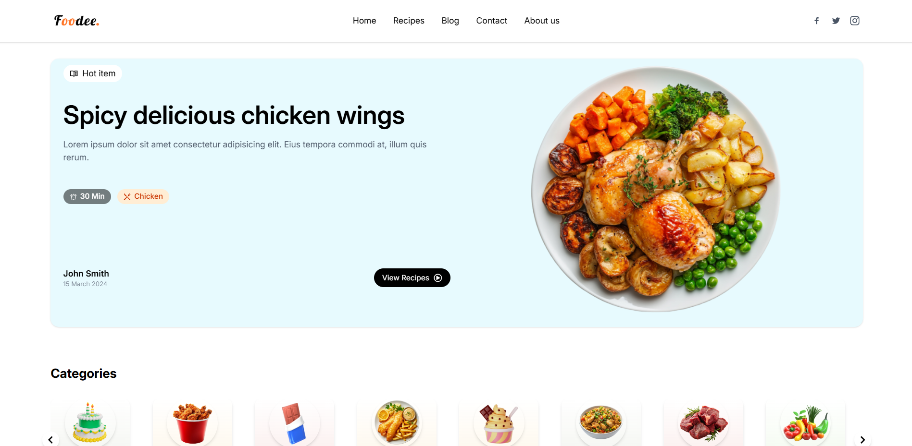

# 🍲 Foodee - Simple & Tasty Recipe App

Foodee is a responsive and animated recipe browsing web application built with **React**, **Tailwind CSS**, and **Framer Motion**. It provides users with simple, easy-to-follow recipes in a clean and modern UI.



---

## 🚀 Features

- ✅ Beautiful animated recipe cards with Framer Motion
- ✅ Responsive layout for all screen sizes
- ✅ Scroll-triggered entrance animations
- ✅ Tailwind-based custom theme and utility-first design
- ✅ Dynamic recipe list with category & time info
- ✅ Gradient backgrounds and smooth hover effects

---

## 🛠️ Technologies Used

- ⚛️ React.js (with Vite)
- 🎨 Tailwind CSS
- 🎞️ Framer Motion
- 📦 React Icons

---

## 📂 Folder Structure

```
foodee/
├── README.md
├── eslint.config.js
├── index.html
├── package-lock.json
├── package.json
├── vite.config.js
├── public/
│ ├── favicon.ico
│ └── preview.png
├── src/
│ ├── App.jsx
│ ├── index.css
│ ├── main.jsx
│ ├── Pages/
│ │ ├── About.jsx
│ │ ├── Home.jsx
│ │ └── Loader.jsx
│ ├── assets/
│ │ ├── CategoryImg/
│ │ ├── RecipeImg/
│ │ └── other images...
│ ├── components/
│ │ ├── Cards/
│ │ ├── Hero/
│ │ ├── Navbar/
│ │ └── LearnMoreSection.jsx
│ ├── data/
│ │ ├── category.js
│ │ └── recipes.js

```

---

## 🔧 Installation & Setup

```bash
# Clone the repo
git clone https://github.com/kkghosh01/foodee
cd foodee

# Install dependencies
npm install

# Start the development server
npm run dev
```

---

## 📦 Build for Production

```bash
npm run build
```

---

## 👨‍🍳 Credits

This project was built by [Kishor Kumar](https://github.com/kkghosh01) as a practice to master React + Tailwind + Animation.

---

## 📄 License

This project is open-source and available under the [MIT License](LICENSE).
